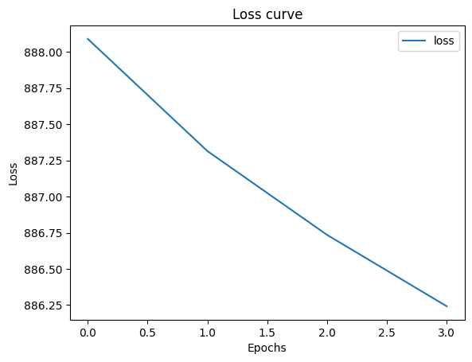

# Developing a Neural Network Regression Model

## AIM
To develop a neural network regression model for the given dataset.

## THEORY
Explain the problem statement

## Neural Network Model
Include the neural network model diagram.

## DESIGN STEPS
### STEP 1: 

Create your dataset in a Google sheet with one numeric input and one numeric output.

### STEP 2: 

Split the dataset into training and testing

### STEP 3: 

Create MinMaxScalar objects ,fit the model and transform the data.

### STEP 4: 

Build the Neural Network Model and compile the model.

### STEP 5: 

Train the model with the training data.

### STEP 6: 

Plot the performance plot

### STEP 7: 

Evaluate the model with the testing data.

### STEP 8: 

Use the trained model to predict  for a new input value .

## PROGRAM

### Name: SUDHARSAN S

### Register Number: 212224040334
```python
from google.colab import drive
drive.mount('/content/drive')

```

Mounted at /content/drive


```python
import pandas as pd
import numpy as np
import seaborn as sns
import torch
import torch.nn as nn
import torch.optim as optim
from sklearn.preprocessing import MinMaxScaler
from sklearn.model_selection import train_test_split

```


```python
dataset1 = pd.read_csv('/content/drive/MyDrive/dp.csv')
dataset1.head(5)
```


<div id="df-faf6f727-73d0-444a-a324-5b90f28ba7cd" class="colab-df-container">
<div>
<table border="1" class="dataframe">
<thead>
<tr style="text-align: right;">
<th></th>
<th>input</th>
<th>output</th>
</tr>
</thead>
<tbody>
<tr>
<th>0</th>
<td>1</td>
<td>1.526880</td>
</tr>
<tr>
<th>1</th>
<td>2</td>
<td>-2.799454</td>
</tr>
<tr>
<th>2</th>
<td>3</td>
<td>5.972655</td>
</tr>
<tr>
<th>3</th>
<td>4</td>
<td>13.081876</td>
</tr>
<tr>
<th>4</th>
<td>5</td>
<td>-1.553627</td>
</tr>
</tbody>
</table>
</div>
<div class="colab-df-buttons">

<div class="colab-df-container">


</div>


</div>
</div>


```python
X = dataset1[['input']].values
y = dataset1[['output']].values
print(X)
print(y)
```

[[ 1]
[ 2]
[ 3]
[ 4]
[ 5]
[ 6]
[ 7]
[ 8]
[ 9]
[10]
[11]
[12]
[13]
[14]
[15]
[16]
[17]
[18]
[19]
[20]
[21]
[22]
[23]
[24]
[25]
[26]
[27]
[28]
[29]
[30]
[31]
[32]
[33]
[34]
[35]
[36]
[37]
[38]
[39]
[40]
[41]
[42]
[43]
[44]
[45]
[46]
[47]
[48]
[49]
[50]]
[[ 1.52688043]
[-2.79945414]
[ 5.97265494]
[13.08187641]
[-1.55362657]
[-4.09967128]
[ 3.20317037]
[11.27881635]
[ 8.0028915 ]
[16.84704304]
[22.51498739]
[10.62741239]
[10.26498398]
[16.54528382]
[10.16363266]
[15.75445039]
[24.07339006]
[11.43162844]
[23.6333223 ]
[18.7922939 ]
[17.90476984]
[22.59614224]
[16.97102168]
[22.08922967]
[13.68671111]
[27.12552903]
[24.90491032]
[20.39220322]
[38.80814262]
[33.72227629]
[32.12725989]
[26.77846093]
[29.2442968 ]
[29.10341027]
[25.15506252]
[37.8346644 ]
[34.98514446]
[33.77049575]
[39.35352864]
[39.51876192]
[27.97060409]
[49.45739164]
[48.2078856 ]
[43.29963449]
[44.40423438]
[46.92760852]
[39.86982251]
[53.81267666]
[50.56990599]
[51.66466445]]


```python
X_train, X_test, y_train, y_test = train_test_split(X, y, test_size=0.33, random_state=33)
```


```python
scaler = MinMaxScaler()
X_train = scaler.fit_transform(X_train)
X_test = scaler.transform(X_test)
```


```python
X_train_tensor = torch.tensor(X_train, dtype=torch.float32)
y_train_tensor = torch.tensor(y_train, dtype=torch.float32).view(-1, 1)
X_test_tensor = torch.tensor(X_test, dtype=torch.float32)
y_test_tensor = torch.tensor(y_test, dtype=torch.float32).view(-1, 1)
```


```python
class NeuralNet(nn.Module):
def __init__(self):
super().__init__()
# Include your code here
self.fc1 = nn.Linear(1,8)
self.fc2 = nn.Linear(8,10)
self.fc3 = nn.Linear(10,1)
self.relu = nn.ReLU()
self.history = {'loss': []}

def forward(self,x):
x = self.relu(self.fc1(x))
x = self.relu(self.fc2(x))
x = self.fc3(x)
return x
```


```python
lig = NeuralNet ()
criterion = nn. MSELoss ()
optimizer = optim.RMSprop (lig. parameters(), lr=0.001)
```


```python
def train_model(ai_brain,x_train,y_train,criterian,optimizer,epochs=4):
for epoch in range(epochs):
optimizer.zero_grad()
outputs = ai_brain(x_train)
loss = criterian(outputs,y_train)
loss.backward()
optimizer.step()
lig.history['loss'].append(loss.item())
if epoch % 200==0:
print(f"Epoch [{epoch}/{epochs}],Loss: {loss.item():.6f}")
```


```python
train_model(lig, X_train_tensor, y_train_tensor, criterion, optimizer)
with torch.no_grad():
test_loss = criterion(lig(X_test_tensor), y_test_tensor)
print(f'Test Loss: {test_loss.item():.6f}')
```

Epoch [0/4],Loss: 888.090271
Test Loss: 742.729797


```python
with torch.no_grad():
test_loss = criterion(lig(X_test_tensor), y_test_tensor)
print(f'Test Loss: {test_loss.item():.6f}')
```


```python
loss_df = pd.DataFrame(lig.history)
```


```python
import matplotlib.pyplot as plt
loss_df.plot()
plt.xlabel("Epochs")
plt.ylabel("Loss")
plt.title("Loss curve")
plt.show()
```





```python
X_n1_1 = torch.tensor([[9]], dtype=torch.float32)
prediction = lig(torch.tensor(scaler.transform(X_n1_1), dtype=torch.float32)).item()
print(f'Prediction: {prediction}')
```

Prediction: 0.15411143004894257


### Dataset Information


### OUTPUT

### Training Loss Vs Iteration Plot


### New Sample Data Prediction


## RESULT
Thus, a neural network regression model was successfully developed and trained using PyTorch.
